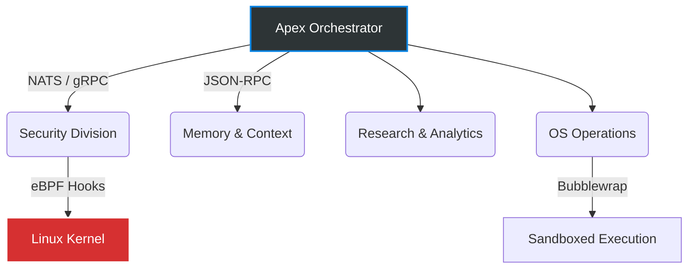

<div align="center">
  <h1>🚀 AutoNix</h1>
  <p><b>The First Zero-Trust, eBPF-Secured Multi-Agent OS for Linux</b></p>
  
  
  
  
  
</div>

---

> 🤖 **Generated via SwarmForge:**  
> The boilerplate and agent configurations for AutoNix were generated using **[Sh3rm/swarmforge](https://github.com/Sh3rm/swarmforge)**.

## 🤔 Why AutoNix?

Tired of giving AI agents unrestricted terminal access and praying they don't break your server? 

**AutoNix** changes the paradigm. It is an enterprise-grade autonomous swarm of 30 specialized Go agents that run strictly within a **Zero-Trust Linux environment**. By leveraging eBPF (Tetragon/Cilium) hooks and Bubblewrap sandboxing, AutoNix traps destructive commands *before* they hit the kernel, routing them to a Human-in-the-Loop (HITL) approval gate.

If you want AI to manage your infrastructure without risking catastrophic failure, you need AutoNix.

---

## ⚡ Core Architecture: The Agentic Loop

AutoNix abandons "guesswork" coding. Every agent operates on a strict **Gather-Act-Verify (Idempotency)** loop. 
If an agent doesn't know a package version, it is cryptographically forced to use the DuckDuckGo MCP to research it first. **No Hallucinations. No blind execution.**



### 🌟 Key Highlights
- **eBPF Destructive Gates:** Hooked system calls trap `rm -rf`, `chmod -R`, and firewall modifications automatically.
- **Anti-Laziness Division:** 30 isolated sub-agents, meaning the "Bash Executor" doesn't do the research; the "Patch Analyzer" does. Pure separation of concerns.
- **Smart Model Routing:** Heavy reasoning runs on high-tier models, while fast OS interactions use optimized Flash models, saving 80% on token costs.
- **Bubbletea TUI:** Watch your swarm think, debate, and execute in a beautiful, non-blocking terminal UI.

---

## 🛠️ The Swarm Roster (30 Agents)

From embedded vector databases (`chromem-go`) to raw IPC managers, AutoNix is massive.

| Division | Core Responsibility | Sample Agent |
| :--- | :--- | :--- |
| **🛡️ Security** | Kernel-level syscall hooking & Sandboxing | `ebpf-destructive-gate` |
| **⚙️ OS Ops** | Safe shell execution and file mapping | `os-bash-executor` |
| **🧠 Memory** | RAG, Vector DB, and Garbage Collection | `mem-context-pruner` |
| **🕸️ Network** | NATS broker messaging & gRPC routing | `net-nats-broker` |
| **🔬 Research** | Deep Web Scouting via DuckDuckGo MCP | `research-patch-analyzer` |

---

## 🚀 Quick Start

AutoNix is powered by the **[Antigravity (AGY)](https://github.com/Sh3rm/swarmforge)** engine. 

1. Ensure the `agy` CLI is installed on your machine.
2. Clone this repository:
   ```bash
   git clone https://github.com/yourusername/AutoNix.git
   cd AutoNix
   ```
3. Boot the swarm:
   ```bash
   agy
   ```

---

## 📜 Credits & Powered By

The agent configurations, security models, and prompt architectures in this repository were generated using **[SwarmForge](https://github.com/Sh3rm/swarmforge)**.
